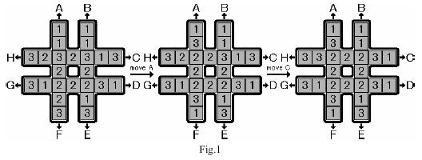

# 迭代加深搜索

## 埃及分数  

[codevs1288](http://codevs.cn/problem/1288/)

### 题意

题目意思为给定一个单位分数，拆分为几个单位分数之和，要求不能有相同的单位分数，且个数最少。当个数相同的，最小的分数最大的方案为最优。   

### 思路  

从小到大枚举拆分的分数个数，然后dfs搜索，即迭代加深搜索。  
需要注意的是，需要剪枝，    
1.枚举分母时由于受分数大小限制，所以分母有下限。
2.枚举分母是由于总个数确定maxd，当前已枚举的个数确定d,所以剩余个数确定maxd-d+1,
所以分母有上限，(maxd-d+1)x(1/i) > x/y  

### 代码

```c++
#include <bits/stdc++.h>
using namespace std;
const int INF = 0x3f3f3f3f;
const int maxn = 2000;
typedef long long LL;

int maxd = 0;
LL ans[maxn],cur[maxn];

LL gcd(LL a, LL b) { return b == 0 ? a : gcd(b,a%b);}
int st(int x, int y) {for(int i = 2; ; i++ ) if(y <= x*i)return i;}

bool check(int d)
{
  if(ans[d] == -1) return true;
  if(ans[d] > cur[d]) return true;
  return false;
}

bool idfs(int d, int mind, LL x, LL y) //mind 最小的分母
{
  bool ok = false;
  if(d == maxd)
  {
    if(y%x != 0) return false;
    cur[d] = y/x;
    if(check(d))
    for(int i = 1; i <= d; i++)  ans[i] = cur[i];
    return true;
  }
  int s = max(mind,st(x,y));  //分母下界
  for(int i = s; ;i++)
   {
     if((maxd-d+1)*y <= x*i) break; //剪枝优化
     cur[d] = i;
     LL xx = x*i-y; LL yy = y*i; LL g = gcd(xx,yy);
     if(idfs(d+1,i+1,xx/g,yy/g)) ok = true;
   }
  return ok;
}

int main()
{
  LL x,y;
  scanf("%lld%lld",&x,&y);
  if(y%x == 0) {printf("%d\n",y/x);return 0;}
  int s = st(x,y);
  memset(ans,-1,sizeof(ans));
  while(++maxd)  if(idfs(1,s,x,y)) break;
  for(int i = 1; i <= maxd; i++)
    printf("%lld%c", ans[i], i == maxd? '\n' : ' ');
  return 0;
}

```


## Editing a Book  

[uva11212](https://vjudge.net/problem/UVA-11212)

### 题意

你有一篇n个自然段组成的文章，希望将它们排列成1，2，…，n。可以用Ctrl+X（剪切）和Ctrl+V（粘贴）快捷键来完成任务。每次可以剪切一段连续的自然段，粘贴时按照顺序粘贴。注意，剪贴板只有一个，所以不能连续剪切两次，只能剪切和粘贴交替。例如，为了将{2，4，1，5，3，6}变为升序，可以剪切1将其放到2前，然后剪切3将其放到4前。再如，排列{3，4，5，1，2}，只需一次剪切和一次粘贴即可——将{3，4，5}放在{1，2}后，或者将{1，2}放在{3，4，5}前。

### 思路  

本题利用迭代加深搜索，也是一道典型的状态空间搜索问题，状态就是1~n的排列，初始状态是输入，终止状态是1,2,……n。由于n≤9,排列最多有9！=362880个，但由于每个状态的后继状态比较多，因此仍有TLE的危险。很显然，最坏的情况是需要n-1次剪切，搜索层数不多，但每一层的状态数目又非常庞大，适宜使用IDA*。本题如果利用迭代加深搜索，可以发现做多只需要8步，关键在于如何有效地剪枝。考虑后继不正确的数字的个数h，可以证明每次剪切时h最多减少3（因为一次剪切最多只会改变3个数字的后继，若剪切后这3个数字的后继都正确，则h最多减少了3），因此当h>3*(maxd-d)时剪枝即可
减枝分析（也叫做启发函数）：
当改变一个区间的位置，最多会改变3个数的位置的正确性。
比如 1,2,3,4,5,6.序列，把2,3移动到6后面，那么1的后面变成了5, 而 6的后面编程了2,而3的后面变成 空了，同样，设当前有四个数字 a b c d ，如果把b移到c后面，则改变了a、b、c三个数的后继，所以最多会改变3个数的位置的正确性。
也就是说，对于这道题，如果遍历到了一个深度，（还能遍历的深度 - 当前深度） x 3　< 不正确数字的个数，那么就没有必要继续遍历了，因为往后就是全把这些数字该对了也无法达到理想状态。
知道这个之后时间复杂度的问题就得到解决了，只需要每次枚举该步的所有移动就可以了。
搜索：截取 [i, j] 插入剩余序列的第k个数字前

### 代码

```c++
#include <bits/stdc++.h>

using namespace std;
const int maxn = 10;

int n, Case=0;
int a[maxn];

int is_sort()
{
  int res = 0;
  for(int i = 0; i < n-1; i++) if(a[i]+1 != a[i+1]) res++;
  if(a[n-1] != n) res++;
  return res;
}

bool dfs(int maxd,int d)
{
  int h = is_sort();
  if(h == 0) return true;
  if(h > (maxd-d)*3) return false;

  int b[maxn],old[maxn];
  memcpy(old,a,sizeof(old));
  for(int i = 0; i < n; i++)
   for(int j = i; j < n; j++)
    {
      int tot = 0;
      for(int k = 0; k < i; k++) b[tot++] = old[k];
      for(int k = j+1; k < n; k++) b[tot++] = old[k];
      for(int k = 0; k <= tot; k++)
      {
        int tot1 = 0;
        for(int v = 0; v < k; v++) a[tot1++] = b[v];
        for(int v = i; v <= j; v++) a[tot1++] = old[v];
        for(int v = k; v < tot; v++) a[tot1++] = b[v];
        if(dfs(maxd,d+1)) return true;
      }
    }
    return false;
}

int solve()
{
  for(int i = 1; i < n-1; i++)
    if(dfs(i,0)) return i;
  return n-1;
}

int main()
{
  while(scanf("%d",&n) && n)
  {
    for(int i = 0; i < n; i++) scanf("%d",&a[i]);
    if(is_sort() == 0) {printf("Case %d: %d\n",++Case,0);continue;}
    printf("Case %d: %d\n",++Case,solve());
  }
  return 0;
}

```


## 旋转游戏

[poj2386](http://poj.org/problem?id=2286)

### 题意

一个井字形的棋盘上有8个1,8个2,8个3（图的话测试地址里面有），有8个操作（标号为A~H），表示把某一行或某一列做旋转变换，例如A方向所对的列：A <- 1 1 1 2 2 2 3 3，进行A操作后就是：A <- 1 1 2 2 2 3 3 1。要使最中心的八个方块的数字相同，求出字典序最小的操作序列（如果无需操作，输入“No moves needed”）和最后中心八个方块上的数字。



输入时从棋盘自上而下，自左而右输入24个数字。  
1 1 1 1 3 2 3 2 3 1 3 2 2 3 1 2 2 2 3 1 2 1 3 3    
1 1 1 1 1 1 1 1 2 2 2 2 2 2 2 2 3 3 3 3 3 3 3 3


### 思路  

IDA*搜索，首先，每个格子有三种状态，总共有3^24种状态，即使通过1、2、3都只有8个排除一些内存也是不够的　　　  
1、记录八种旋转的改变数组位置，然后在设定的depth范围内dfs。
2、两个剪枝：  
a)当前操作是上一次操作的逆操作。  
b)当前状态最好情况也无法在depth之内完成任务，即使中间8个格子中最多的数字在最好情况下凑成目标态也超过了depth。  

### 代码

```c++
#include<cstdio>
#include<algorithm>
#include<cstring>
using namespace std;
int rot[8][7]=
{
    0,2,6,11,15,20,22,//A
    1,3,8,12,17,21,23,//B
    10,9,8,7,6,5,4,//C
    19,18,17,16,15,14,13,//D
    23,21,17,12,8,3,1,//E
    22,20,15,11,6,2,0,//F
    13,14,15,16,17,18,19,//G
    4,5,6,7,8,9,10//H
};
int res[]={5,4,7,6,1,0,3,2};
int depth;
bool check(char s[])
{
    char ch=s[6];
    for(int i=0;i<3;i++)
        if(ch!=s[i+6]||ch!=s[15+i])
            return false;
    return ch==s[11]&&ch==s[12];
}

void rotate(int op, char st[])
{
  int t = st[rot[op][0]];
  for(int i = 0; i < 6; i++)  st[rot[op][i]] = st[rot[op][i+1]];
  st[rot[op][6]] = t;
}

bool IDAstar(int k,char st[],char op[],int la)
{
    int cnt[4];
    cnt[1]=cnt[2]=cnt[3]=0;
    for(int i=0;i<3;i++)
        cnt[st[i+6]-'0']++,cnt[st[15+i]-'0']++;
    cnt[st[11]-'0']++,cnt[st[12]-'0']++;
    cnt[0]=max(max(cnt[1],cnt[2]),cnt[3]);
    if(k+8-cnt[0]>=depth)
        return false;
    for(int i=0;i<8;i++)
    {
        if(la!=-1&&res[i]==la)
            continue;
        op[k]='A'+i;
        rotate(i,st);
        if(check(st))
        {
            op[k+1]='\0';
            return true;
        }
        else if(IDAstar(k+1,st,op,i))
            return true;
        rotate(res[i],st);
    }
    return false;
}
int main()
{
    char ch;
    while(scanf(" %c",&ch),ch!='0')
    {
        char st[25];
        st[0]=ch;
        for(int i=1;i<24;i++)
            scanf(" %c",&st[i]);
        depth=1;
        if(check(st))
        {
            printf("No moves needed\n%c\n",st[6]);
        }
        else
        {
            char op[200];
            op[0]='\0';
            while(!IDAstar(0,st,op,-1))
                depth++;
            printf("%s\n%c\n",op,st[6]);
        }
    }
    return 0;
}

```


## 埃及分数  

[luogu2668](https://www.luogu.org/problemnew/show/P2668)

### 题意

【题目描述】牛牛最近迷上了一种叫斗地主的扑克游戏。斗地主是一种使用黑桃、红心、梅花、方片的A到K加上大小王的共54张牌来进行的扑克牌游戏。在斗地主中，牌的大小关 系根据牌的数码表示如下：3<4<5<6<7<8<9<10<J<Q<K<A<2<小王<大王3<4<5<6<7<8<9<10<J<Q<K<A<2<小王<大王，而花色并不对牌的大小产生影响。每一局游戏中，一副手牌由 nn 张牌组成。游戏者每次可以根据规定的牌型进行出牌，首先打光自己的手牌一方取得游戏的胜利。

现在，牛牛只想知道，对于自己的若干组手牌，分别最少需要多少次出牌可以将它们打光。请你帮他解决这个问题。

需要注意的是，本题中游戏者每次可以出手的牌型与一般的斗地主相似而略有不同。具体规则如下：

|牌型|	牌型说明	|牌型举例|
|:-:|:-:|:-:|
|火箭|	即双王（双鬼牌）|	♂ ♀|
|炸弹|	四张同点牌。|	♠A ♥A ♣A ♦A|
|单张牌|	单张牌	|♠3|
|对子牌|	两张码数相同的牌|	♠2 ♥2|
|三张牌|	三张码数相同的牌|	♠3 ♥3 ♣3|
|三带一|	三张码数相同的牌 + 一张单牌|	♠3 ♥3 ♣3 ♠4|
|三带二|	三张码数相同的牌 + 一对牌|	♠3 ♥3 ♣3 ♠4 ♥4|
|单顺子|	五张或更多码数连续的单牌（不包括 2 点和双王）|	♠7 ♣8 ♠9 ♣10 ♣J|
|双顺子|	三对或更多码数连续的对牌（不包括 2 点和双王）|	♣3 ♥3 ♠4 ♥4 ♠5 ♥5|
|三顺子|	二个或更多码数连续的三张牌（不能包括 2 点和双王）|	♠3 ♥3 ♣3 ♠4 ♥4 ♣4 ♠5 ♦5 ♥5|
|四带二|	四张码数相同的牌+任意两张单牌（或任意两对牌）	|♠5 ♥5 ♣5 ♦5 ♣3 ♣8|

### 思路  

先预处理出所有不打顺子的情况，再深搜枚举顺子。  
暴力+贪心，暴力枚顺子

### 代码

```c++

#include<cstdio>
#include<cstring>
#include<climits>

int t,n,x,y,a[5],b[14],maxx;

int qiu()
{
	int tot=0;
	memset(a,0,sizeof(a));
	for(int i=0;i<=13;i++) a[b[i]]++;
	while(a[4] && a[2]>1) a[4]--,a[2]-=2,tot++;
	while(a[4] && a[1]>1) a[4]--,a[1]-=2,tot++;
	while(a[4] && a[2]) a[4]--,a[2]--,tot++;
	while(a[3] && a[2]) a[3]--,a[2]--,tot++;
	while(a[3] && a[1]) a[3]--,a[1]--,tot++;
	return tot+a[1]+a[2]+a[3]+a[4];
}

void dfs(int u)  //搜索顺子,二顺子,三顺子
{
	if(u>=maxx) return;int kk=qiu();
	if(u+kk<maxx) maxx=u+kk;
	for(int i=2;i<=13;i++)
	{
		int j=i;
		while(b[j]>=3 && j<=13) j++;
		if(j-i>=2)
		  for(int v=i+1;v<=j-1;v++)
		  {

			for(int vk=i;vk<=v;vk++) b[vk]-=3;
			dfs(u+1);
			for(int vk=i;vk<=v;vk++) b[vk]+=3;
		  }
	}
	for(int i=2;i<=13;i++)
	{
		int j=i;
		while(b[j]>=2 && j<=13) j++;
		if(j-i>=3)
		  for(int v=i+2;v<=j-1;v++)
		  {
			for(int vk=i;vk<=v;vk++) b[vk]-=2;
			dfs(u+1);
			for(int vk=i;vk<=v;vk++) b[vk]+=2;
		  }
	}
	for(int i=2;i<=13;i++)
	{
		int j=i;
		while(b[j]>=1 && j<=13) j++;
		if(j-i>=5)
		  for(int v=i+4;v<=j-1;v++)
		  {
			for(int vk=i;vk<=v;vk++) b[vk]--;
			dfs(u+1);
			for(int vk=i;vk<=v;vk++) b[vk]++;
		  }
	}
}

int main()
{
	scanf("%d%d",&t,&n);
	while(t--)
	{
		maxx=INT_MAX;
		memset(b,0,sizeof(b));
		for(int i=1;i<=n;i++)
		{
			scanf("%d%d",&x,&y);
			if(x==1) x=13;
			else if(x) x--;
			b[x]++;
		}
		dfs(0);
		printf("%d\n",maxx);
	}
	return 0;
}

```
