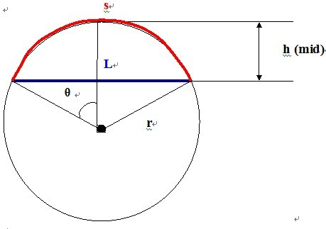

# 简单二分

## 膨胀的木棍

来源[NOI Openjudge 1.11 二分查找](http://noi.openjudge.cn/ch0111/09/)

### 描述

当长度为`L`的一根细木棍的温度升高 `n` 度，它会膨胀到新的长度`L'=(1+n*C)*L`，其中`C`是热膨胀系数。当一根细木棍被嵌在两堵墙之间被加热，它将膨胀形成弓形的弧，而这个弓形的弦恰好是未加热前木棍的原始位置。你的任务是计算木棍中心的偏移距离。


### 输入

三个非负实数：木棍初始长度（单位：毫米），温度变化（单位：度），以及材料的热膨胀系数。
保证木棍不会膨胀到超过原始长度的`1.5`倍。

### 输出

木棍中心的偏移距离（单位：毫米），保留到小数点后第三位。

### 样例输入
	
	1000 100 0.0001

### 样例输出

	61.329


### 思路

设偏移距离为`x`，用勾股定理计算半径，算出弧长判断弧长与实际的偏差，调整边界。



### Code

```c++
#include<bits/stdc++.h>
double L,n,c,b,b1,l,r,R,hd;
int main()
{
    cin>>l>>n>>c;
	b=(1+n*c)*L;
    L/=2;
    b/=2;//计算出膨胀后的木棍
	l=0;r=L;//膨胀的偏移距离最小为0，最大本为1.5L，但取略大值L/2*π，所以最大值取L/2，L已经平分
	while(l+1e-4<=r)//循环条件，注意精度值（保留到小数点后第三位）
	{
		double mid=(l+r)/2;
		R=(L*L+mid*mid)/(2*mid);//勾股定理化简(R-mid)²+L²=R²
		hd=asin(L/R);//计算弧度，正弦定理
		b1=hd*R;//弧长计算公式
		if(b1<b)	l=mid;//如果小于，证明取值偏小，修改边界
		else r=mid;
	}
	printf("%.3lf",l);
}
```

## Can you solve this equation?


### 题目描述

给你一个等式，`8*x^4 + 7*x^3 + 2*x^2 + 3*x + 6 == Y` ，求方程在范围`[0,100]`内的解
 
### 输入格式

第一行一个整数`T`，表示数据组数

接下来`T`行，每行一个实数`Y`

### 输出格式

对于每组数据，如果解存在，输出结果并保留`4`位小数，否则输出`No solution!`

### 输入样例

    2
    100
    -4

### 输出样例

    1.6152
    No solution!
    
### 数据范围

- `fabs(Y)<=1e10`

测试网站[hdoj 2199](http://acm.hdu.edu.cn/showproblem.php?pid=2199)

### 题目分析

题目要求我们根据`Y`去求解`X`,但是对于`X`的精确度要求较高，所以去枚举答案肯定会超时。

于是我们去考虑等式的性质，令`f(x)=8*x^4 + 7*x^3 + 2*x^2 + 3*x + 6`，我们可以通过观察得到当`x>=0`时`f(x)`是单调的，即随着`x`的变大`f(x)`会变大。

也可以通过证明：

对`f(x)`求导得到`f(x)'=32*x^3 + 21*x^2 + 4*x + 3`，可以发现对于`x>=0`，`f(x)'>=0`，即导数大于等于`0`，所以`f(x)`在范围`[0,100]`上是递增的。

那么我们可以根据`f(x)`单调的性质去二分`x`的值，然后比较`f(x)`与`Y`的大小求解。

### 代码示例

```c++
#include<cstdio>
#include<cmath>
#include<cstring>
using namespace std;

double get_f(double x)  //返回f(x)的值
{
    return 8*x*x*x*x+7*x*x*x+2*x*x+3*x+6;
}

int main()
{
    int T;
    double Y;
    double l,r;
    scanf("%d",&T);
    while(T--)
    {
        scanf("%lf",&Y);
        if(get_f(0)>Y||get_f(100)<Y) puts("No solution!");  //无解的情况
        else
        {
            double l=0,r=100;                              //二分的上下界
            while(fabs(r-l)>1e-8)                          //精度控制
            {
                double mid=(l+r)/2;      
                if(get_f(mid)>Y)                           //如果f(mid)>Y,那么解一定在[l,mid]内
                {
                    r=mid;
                }
                else                                       //否则解一定在[mid,r]内
                {
                    l=mid;
                }
            }
            printf("%.4f\n",l);
        }
    }
}
```


## Letters

测试网站[codeforces](https://codeforces.com/contest/1073/problem/C)

### 题目描述

有一个机器人，一开始在`(0,0)`,能执行`L`,`R`,`U`,`D`四个指令:

- L —— 从`(x,y)`移动到`(x-1,y)`
- R —— 从`(x,y)`移动到`(x+1,y)`
- U —— 从`(x,y)`移动到`(x,y+1)`
- D —— 从`(x,y)`移动到`(x,y-1)`

现在机器人已经被写入了`n`个程序，小明为了机器人执行完`n`个操作后到达`(x,y)`，想要对其中某些指令进行修改。

小明想让修改的区间尽可能小，计算方法为:`Max_id-Min_id+1`，其中`Max_id`为修改的指令下标最大值，`Min_id`为修改的指令下标最小值。

小明想知道修改的区间长度最小为多少。(如果不修改任何一个指令，长度为`0`，保证不删去或者增加指令，即指令总长度不变)

### 输入格式

第一行一个整数`n`，表示指令总长度。

第二行一个长度为`n`的字符串，表示机器人原有指令。保证字符串只由`L`,`R`,`U`,`D`组成。

第三行两个整数`x`,`y`,需要达到的点的坐标。


### 输出格式

如果能到达`(x,y)`，输出修改区间的长度最小值。

否则输出`-1`。

### 输入样例

    5
    RURUU
    -2 3

### 输出样例

    3
    
### 样例解释
    
将指令改为`LULUU`即可，长度为`3-1+1=3`.
    
### 数据范围

- 1<=n<=2*10^5
- -10^9<=x,y<=10^9


### 题目分析
   
首先，我们我们进行两个特判
   
1. 如果指令长度小于到达`(x,y)`的最小步数，输出`-1`。
2. 指令长度与到达`(x,y)`的最小步数不是同奇同偶，输出`-1`。

然后我们易知，答案要不是`1`,`3`,`5`,`7`....,要么是`0`,`2`,`4`,`6`...

且如果修改长度为`len`的区间可行，那么修改长度为`len+2`的区间也一定可行(多出来的两个位置可以不变)

根据这个性质，我们就可以二分长度，对于每个长度枚举修改区间的起点，判断是否有可行的方案。

### 代码示例

```c++
#include <cstdio>
#include <bits/stdc++.h>
#include <map>
#include <cstring>
#include <algorithm>
using namespace std;
#define mst(a,b) memset((a),(b),sizeof(a))
#define rush() int T;scanf("%d",&T);while(T--)
#define MP(a,b) make_pair(a,b)

typedef long long ll;
const int maxn = 200005;
const ll INF = 1e18;
const ll mod=1e9+7;
const double eps = 1e-5;

int n;
int x,y;
char s[maxn];

int prex[maxn],prey[maxn];

int judge(int gap){
    for(int i=1;i+gap-1<=n;i++){
        int l=i,r=i+gap-1;
        int dx=prex[n]-prex[r]+prex[l-1];
        int dy=prey[n]-prey[r]+prey[l-1];

        int tmp=abs(x-dx)+abs(y-dy);
        if(tmp<=r-l+1&&(tmp%2==(r-l+1)%2)) return 1;
    }
    return 0;
}

int main(){
    scanf("%d%s",&n,s+1);

    for(int i=1;i<=n;i++){
        prex[i]=prex[i-1];
        prey[i]=prey[i-1];
        if(s[i]=='R') prex[i]++;
        else if(s[i]=='L') prex[i]--;
        else if(s[i]=='U') prey[i]++;
        else if(s[i]=='D') prey[i]--;
    }
    scanf("%d%d",&x,&y);
    int need=abs(x)+abs(y);
    if(need>n||(need%2+n%2==1)) return puts("-1"),0;
    if(prex[n]==x&&prey[n]==y) return puts("0"),0;
    int ans=-1;
    int l=1,r=n;
    while(l<=r)
    {
        int mid=(l+r)/2;
        if(judge(mid))
        {
            ans=mid;
            r=mid-1;
        }
        else l=mid+1;
    }
    printf("%d\n",ans);
}
```


## Letters

测试网站[codeforces](https://codeforces.com/contest/978/problem/C)

### 题目描述

柏林大学有 `n` 幢公寓楼，依次用`1 ~ n`编号，每幢公寓楼由一系列房间组成，假设第i幢公寓楼有`a[i]`个房间，房间号分别为`1 ~ a[i]`。

有一个快递员要送信到一个房间，但是信封上却没有写明需要送到第几幢第几个房间，只有这个房间在所有房间中的编号（从第一幢楼第一个房间依次编号）。

现在有`m`个信封，每个信封上只有需要送到的房间在所有房间中的编号。问这个房间位于第几幢公寓楼的第几个房间。

举个例子，如果`n=2, a[1]=3, a[2]=5`,信封上的编号可以是`1~8`,如果写着`7`,那么就代表需要送到第`2`幢公寓楼的第`4`个房间。

### 输入格式

第一行两个整数`n`，`m`，表示公寓楼数量和信封数量。

第二行`n`个整数 `a[i]`, 表示第 `i` 幢公寓楼的房间数量。

第三行`m`个整数`b[j]`,表示第 `j` 个信封上的编号。保证给出的`b[j]`是递增的。


### 输出格式

对于每个信封的数字输出一行，每行两个数字`f`,`k`，用空格隔开，表示需要送到第`f`幢公寓楼的第`k`个房间。

### 输入样例

    3 6
    10 15 12
    1 9 12 23 26 37

### 输出样例

    1 1
    1 9
    2 2
    2 13
    3 1
    3 12
    
### 数据范围
- $1 \le n, m \le 2*10^5$
- $1 \le a_i \le 10^{10}$
- $1 \le b_j \le a_1 + a_2 + ... + a_n$


### 题目分析
   
   首先，最简单的方法就是记录房间总数的前缀和，对于查询的编号依次遍历每幢公寓楼的前缀和，第一个大于等于编号的位置x就说明了在第x幢。然后作一下差就能同时得到房间号。
   
```c++
#include <cstdio>
#include <bits/stdc++.h>
#include <cmath>
#include <map>
#include <iostream>
#include <cstring>
#include <algorithm>
using namespace std;
#define mst(a,b) memset((a),(b),sizeof(a))
#define rush() int T;scanf("%d",&T);while(T--)

typedef  long long ll;
const int maxn = 200005;
const ll mod = 1e9+7;
const int INF = 1e9;
const double eps = 1e-6;

int n,m;
ll a[maxn];
ll sum[maxn];
char s[maxn];

int main()
{
    scanf("%d%d",&n,&m);
    for(int i=1;i<=n;i++){
        scanf("%lld",&a[i]);
        sum[i]=sum[i-1]+a[i];
    }

    for(int i=0;i<m;i++){
        ll x;
        scanf("%lld",&x);
        int pos=-1;
        for(int j=1;j<=n;j++){
            if(sum[j]>=x){
                pos=j;
                break;
            }
        }
        //int pos=lower_bound(sum+1,sum+1+n,x)-sum;
        ll res=x-sum[pos-1];
        printf("%d %lld\n",pos,res);
    }
}
```
   
冷静分析一下，其复杂度为O(nm)，显然会超时。

于是我们想到可以用二分找这个位置x,这里我们既可以用手写二分，也可以用lower_bound()函数，这样能把时间复杂度降到`O(mlogn)`.
   

### 代码示例1

```c++
#include <cstdio>
#include <bits/stdc++.h>
#include <cmath>
#include <map>
#include <iostream>
#include <cstring>
#include <algorithm>
using namespace std;
#define mst(a,b) memset((a),(b),sizeof(a))
#define rush() int T;scanf("%d",&T);while(T--)

typedef  long long ll;
const int maxn = 200005;
const ll mod = 1e9+7;
const int INF = 1e9;
const double eps = 1e-6;

int n,m;
ll a[maxn];
ll sum[maxn];
char s[maxn];

int main()
{
    scanf("%d%d",&n,&m);
    for(int i=1;i<=n;i++)
    {
        scanf("%lld",&a[i]);
        sum[i]=sum[i-1]+a[i];
    }
    for(int i=0;i<m;i++)
    {
        ll x;
        scanf("%lld",&x);
        int pos=lower_bound(sum+1,sum+1+n,x)-sum;
        ll res=x-sum[pos-1];
        printf("%d %lld\n",pos,res);
    }
}
```

### 代码示例2

```c++
#include <cstdio>
#include <bits/stdc++.h>
#include <cmath>
#include <map>
#include <iostream>
#include <cstring>
#include <algorithm>
using namespace std;
#define mst(a,b) memset((a),(b),sizeof(a))
#define rush() int T;scanf("%d",&T);while(T--)

typedef  long long ll;
const int maxn = 200005;
const ll mod = 1e9+7;
const int INF = 1e9;
const double eps = 1e-6;

int n,m;
ll a[maxn];
ll sum[maxn];
char s[maxn];

int main()
{
    scanf("%d%d",&n,&m);
    for(int i=1;i<=n;i++)
    {
        scanf("%lld",&a[i]);
        sum[i]=sum[i-1]+a[i];
    }
    for(int i=0;i<m;i++)
    {
        ll x;
        scanf("%lld",&x);
        int pos=-1;
        int l=1,r=n;
        while(l<=r)
        {
            int mid=(l+r)/2;
            if(sum[mid]>=x)
            {
                pos=mid;
                r=mid-1;
            }
            else l=mid+1;
        }
        ll res=x-sum[pos-1];
        printf("%d %lld\n",pos,res);
    }
}

```
   
   
   
