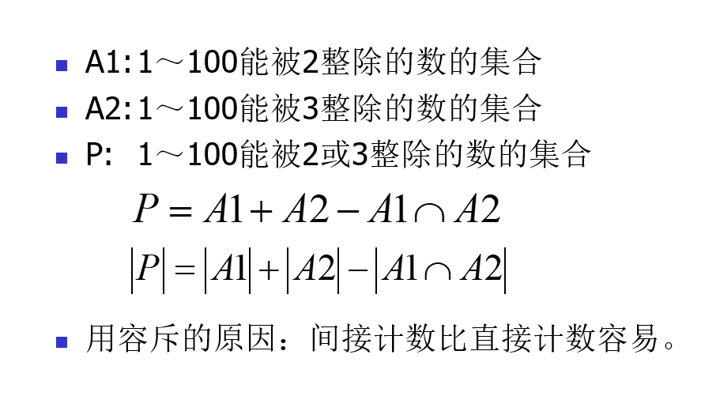
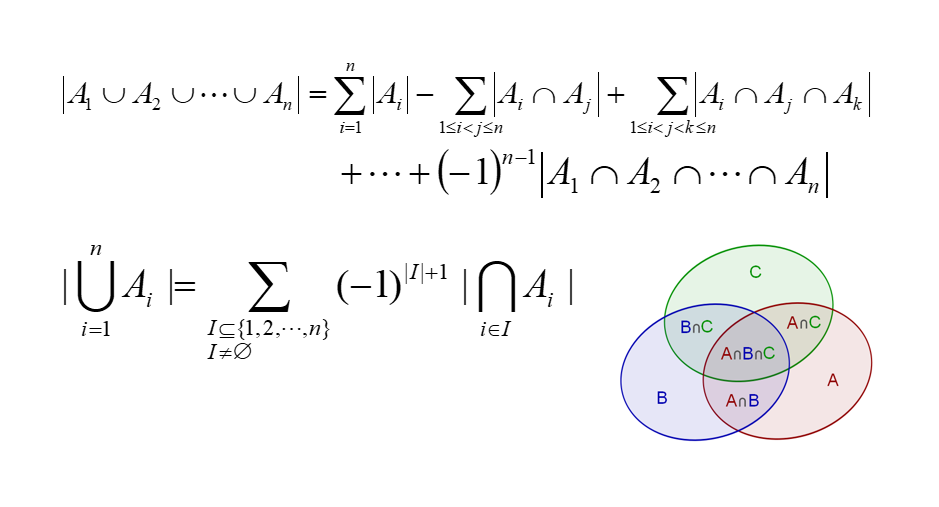

# 容斥专题





## 整数的力量(Integer Power)

[HDU](<https://vjudge.net/contest/247999#problem/A>)

**tags: 容斥，高精度开根号**

### 题意

在一个区间$[l,r]$，其中每一个数必定可以写成写成$a^p$的形式，现在设$p$的和为$res$，问你在$[l,r]$区间内最大的$res$为多少。

### 思路

首先，不难发现，对于一段区间而言，区间某个数的幂的个数存在着累加性。即倘若我们需要求区间[l,r]的结果，我们只需要先求出区间$[1,r]​$的结果$res1​$，再求出区间$[1,l-1]​$的结果$res2​$，之后用$res1-res2​$即为区间[l,r]的结果。

之后题目就转化为区间内$a^k$的个数问题，显然有$\lfloor n^{\frac{1}{k}}\rfloor$种，因此我们枚举$k$

但是，这么做显然是会重复计数的，如$2^4 = 4^2 = ...$因此我们还需要把重复的部分根据容斥原理剪掉。因为题目中要求我们使得结果最大，因此我们需要尽可能的让幂数大的保留下来，也就是说，幂数较小的需要排斥掉。因此我们可以考虑最后从大到小枚举幂数，如果发现两个幂数$（i \mod j == 0 , i>j)$我们就把$j$中$j$和$i$相同的部分抹去。

### 代码

```C++
#include <bits/stdc++.h>
using namespace std;
typedef long long ll;
ll sum[80];
const double eps=1e-18;
const ll inf = (ll)(1e18) + 500;
const ll INF = (ll)1 << 31;
 
ll multi(ll a,ll b){
    ll ans=1;
    while(b){
        if(b&1){
            double judge=1.0*inf/ans;
            if(a>judge) return -1;
            ans*=a;
        }
        b>>=1;
        if(a>INF&&b>0) return -1;
        a=a*a;
    }
    return ans;
}
ll Find(ll x,ll k){
    ll r=(ll)pow(x,1.0/k);
    ll t,p;
    p=multi(r,k);
    if(p==x) return r;
    if(p>x||p==-1) r--;
    else
    {
        t=multi(r+1,k);
        if(t!=-1&&t<=x) r++;
    }
    return r;
}
 
ll solve(ll n){
    sum[1]=n;
    int maxx=0;
    for(int i=2;i<64;i++){
        sum[i]=Find(n,1ll*i);
        sum[i]--;
        if(sum[i]==0){
            maxx=i;
            break;
        }
    }
    for(int i=maxx;i>=2;i--){
        for(int j=1;j<i;j++){
            if(i%j==0) sum[j]-=sum[i];
        }
    }
    ll res=0;
    for(int i=1;i<=maxx;i++){
        res+=sum[i]*i;
    }
    return res;
}
int main()
{
    ll a,b;
    while(cin>>a>>b){
        if(a==0) break;
        ll ans=solve(b)-solve(a-1);
        cout<<ans<<endl;
    }
    return 0;
}
```

## GCD

[HDU-1695](<https://vjudge.net/contest/247999#problem/B>)

**Tags: 数论，容斥，莫比乌斯反演，欧拉函数**

### 题意

求$(1,b)$区间和$(1，d)$区间里面$gcd(x, y) = k$的数的对数$(1 \le x \le b , 1\le y \le d)$。

### 思路

只需要枚举$x$，然后确定另一个区间里面有多少个$y$就可以了。因此问题转化成为区间$(1,d)​$里面与x互素的数的个数

先求出x的所有质因数，因此$(1,d)$区间里面是x的质因数倍数的数都不会与$x​$互素，因此，只需要求出这些数的个数，减掉就可以了。

如果w是x的素因子，则$(1,d)$中是$w$倍数的数共有$\frac{d}{w}​$个。

### 代码

```C++
#include <cstdio>
#include <cstring>
#include <vector>
#include <algorithm>
using namespace std;
#define N 100005
typedef long long ll;
vector<int> x[N];
bool is[N];
 
void prime() {
    memset(is, false, sizeof(is));
    for (int i=0; i<N; i++) x[i].clear();
 
    for (int j=2; j<N; j+=2) x[j].push_back(2);
    for (int i=3; i<N; i+=2)
        if (!is[i]) {
            for (int j=i; j<N; j+=i) {
                is[j] = true;
                x[j].push_back(i);
            }
        }
}
int work(int u, int s, int w) {
    int cnt = 0, v = 1;
    for (int i=0; i<x[w].size(); i++) {
        if ((1<<i) & s) {
            cnt++;
            v *= x[w][i];
        }
    }
    int all = u/v;
    if (cnt % 2 == 0) return -all;
    else return all;
}
 
int main() {
 
    prime();
 
    int T, a, b, c, d, k;
    scanf("%d", &T);
    for (int cas=1; cas<=T; cas++) {
        scanf("%d%d%d%d%d", &a, &b, &c, &d, &k);
        if (k == 0) {
            printf("Case %d: 0\n", cas);
            continue;
        }
        b /= k, d /= k;
 
        if (b > d) { a = b; b = d; d = a; }
        long long ans = 0;
        for (int i=1; i<=d; i++) {
            k = min(i, b);
            ans += k;
            for (int j=1; j<(1<<x[i].size()); j++)
                ans -= work(k, j, i);
        }
        printf("Case %d: %I64d\n", cas, ans);
    }
    return 0;
}
```

## Lucky Tickets

[URAL-1036]()

**Tags: 容斥，数位DP，大数，高精度**

### 题意

有一个$2n$长度的数字，我们要求前面$n$个数的和等于后面$n$个数的和，前面和后面的总和是$s$，问数字有多少种。

### 思路

用$dp[i][j]$表示前i位和为$j$的数的个数，答案是：$dp[N][S/2]*dp[N$][S/2]

$dp[i][j]=sum(dp[i-1][j-k],0<=k<=9)​$

### 代码

```C++
#include<iostream>
#include<cstring>
#include<string>
#include<cstdlib>
#include<cstdio>
#include<cmath>
#include<algorithm>
#include<queue>
#include<ctime>
#include<vector>
using namespace std;
typedef double db;
template<class T> inline bool updateMin(T& a, T b) { return a>b? a=b, true: false; }
template<class T> inline bool updateMax(T& a, T b) { return a<b? a=b, true: false; }
typedef long long LL;
typedef long unsigned int LU;
typedef long long unsigned int LLU;
#define N 100
#define M 50
#define S 1000
typedef struct bign
{
    int digit[N+1];
    int lenth;
    void valid()
    {
        int i=0,n=lenth-1;
        while(i<n)
        {
            if(digit[i]>=1000)
            {
                digit[i+1]=digit[i]/1000+digit[i+1];
                digit[i]=digit[i]%1000;
            }
            i++;
        }
        while(digit[i])
        {
            if(digit[i]>=1000)
            {
                digit[i+1]=digit[i]/1000;
                digit[i]=digit[i]%1000;
                lenth++;
            }
            i++;
        }
    }
    bign(){memset(digit,0,sizeof(digit));lenth=1;}
    bign operator * (const bign& b)const
    {
        bign c;
        for(int i=0;i<lenth;i++)
        {
            for(int j=0;j<lenth;j++)
            {
                c.digit[i+j]=c.digit[i+j]+digit[i]*b.digit[j];
            }
        }
        c.lenth=lenth+b.lenth-1;
        c.valid();
        return c;
    }
    bign operator + (const bign& b)const
    {
        bign c;
        c.lenth=max(b.lenth,lenth);
        for(int i=0;i<c.lenth;i++)
        {
            c.digit[i]=digit[i]+b.digit[i];
        }
        c.valid();
        return c;
    }
    bign operator = (bign a)
    {
        lenth=a.lenth;
        for(int i=0;i<a.lenth;i++)
        {
            digit[i]=a.digit[i];
        }
        return *this;
    }
    bign operator = (int a)
    {
        digit[0]=a;
        valid();
        return *this;
    }
}Ans;
Ans dp[M+1][S+1],ans;
int n,s;
int main()
{
    scanf("%d%d",&n,&s);
    if(s&1)
    {
        printf("0\n");
        exit(0);
    }
    s/=2;
    for(int i=0;i<=9;i++)dp[1][i]=1;
    for(int i=2;i<=n;i++)
    {
        for(int j=0;j<=s;j++)
        {
            for(int k=0;k<=9&&k<=j;k++)
            {
                dp[i][j]=dp[i][j]+dp[i-1][j-k];
            }
        }
    }
    ans=dp[n][s]*dp[n][s];
    printf("%d",ans.digit[ans.lenth-1]);
    for(int i=ans.lenth-2;i>=0;i--)
    {
        printf("%03d",ans.digit[i]);
    }
    puts("");
	return 0;
}
```


## Co-Prime

[HDU-4135](<https://vjudge.net/contest/247999#problem/J>)

**Tags:  容斥**

### 题意

从区间$[a,b]$中找到与$n$互质的数的个数

### 思路

- 可以通过求出区间内与N互质数的个数的前缀和，即$[1,X]$，来得出$[A,B]$。
- 那么现在问题是求出$[1,X]​$区间内与$N​$互质数的个数，考虑这个问题的逆问题：$[1,X]​$区间内与$N​$不互质数的个数。
- 于是就可以先处理出N的所有质因数${p_0,p_1,p_2,...,p_n}​$。
- 而$[1,X]$能被$p_i$整除的数有$\frac{X}{p_i}$个，再利用容斥原理除掉质因数公倍数重复计数的部分就能求出不互质个数。
- 最后X减去不互质个数就是互质个数了。

### 代码

```C++
#include<cstdio>
#include<cstring>
using namespace std;
int prime[33],pn;
long long calc(long long n){
    long long res=0;
    for(int i=1; i<(1<<pn); ++i){
        int tmp=1,cnt=0;
        for(int j=0; j<pn; ++j){
            if(((i>>j)&1)==0) continue;
            ++cnt;
            tmp*=prime[j];
        }
        if(cnt&1) res+=n/tmp;
        else res-=n/tmp;
    }
    return n-res;
}
int main(){
    long long a,b;
    int t,n;
    scanf("%d",&t);
    for(int cse=1; cse<=t; ++cse){
        scanf("%lld%lld%d",&a,&b,&n);
        pn=0;
        for(int i=2; i*i<=n; ++i){
            if(n%i) continue;
            while(n%i==0) n/=i;
            prime[pn++]=i;
        }
        if(n!=1) prime[pn++]=n;
        printf("Case #%d: %lld\n",cse,calc(b)-calc(a-1));
    }
    return 0;
}
```

