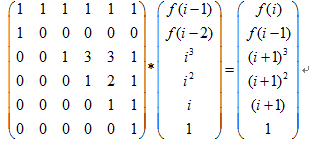

# 又见斐波那契


## 题目描述

这是一个加强版的斐波那契数列。 

给定递推式


求`F(n)`的值，由于这个值可能太大，请对`1e9+7`取模。

## 输入格式

第一行是一个整数`T`，表示样例的个数

以后每个样例一行，是一个整数`n`


## 输出格式

对于每组数据输出方案数,答案对`1e9+7`取膜。

## 输入样例

    4
    1
    2
    3
    100

## 输出样例

    1
    16
    57
    558616258
 
    
## 数据范围

- `1 ≤ T ≤ 1000`
- `1 ≤ n ≤ 10^18`

**【测试网站】**

[nowcoder](https://ac.nowcoder.com/acm/contest/105/G) 

## 题目分析

 由于`n`很大，还是自然地想到矩阵快速幂，但关键是矩阵的构造问题
 
 根据题目的表达式，我们主要要寻找的就是几个常数之间的关系
 
 推算得到：
 
    (i+1)^3=i^3+3*i^2+3*i+1
    
    (i+1)^2=i^2+2*i+1
    
    i+1=i+1
 那么我们就能据此构造出矩阵的转移方程
 
 

  然后套用矩阵快速幂的模板即可。

## 代码示例

```c++
#include <cstdio>
#include <bits/stdc++.h>
#include <cmath>
#include <map>
#include <iostream>
#include <cstring>
#include <algorithm>
using namespace std;
#define mst(a,b) memset((a),(b),sizeof(a))
#define rush() int T;scanf("%d",&T);while(T--)


typedef long long ll;
const int maxn = 6;
const ll mod = 1e9+7;
const int INF = 1e9;
const double eps = 1e-6;

struct Matrix
{
    ll temp[maxn][maxn];
} a;

void init()
{
    for(int i=0;i<6;i++)
    for(int j=0;j<6;j++)
    {
        a.temp[i][j]=0;
    }
    for(int i=0;i<6;i++) a.temp[0][i]=1;
    a.temp[1][0]=1;
    a.temp[2][2]=a.temp[2][5]=1;
    a.temp[2][3]=a.temp[2][4]=3;
    a.temp[3][3]=a.temp[3][5]=1;
    a.temp[3][4]=2;
    a.temp[4][4]=a.temp[4][5]=1;
    a.temp[5][5]=1;
}

Matrix mul(Matrix a,Matrix b)
{
    Matrix ans;
    for (int i=0; i<maxn; i++)
        for (int j=0; j<maxn; j++)
        {
            ans.temp[i][j]=0;
            for (int k=0; k<maxn; k++)
            {
                ans.temp[i][j]+=(a.temp[i][k]*b.temp[k][j]+mod)%mod;  //特别注意
                ans.temp[i][j]%=mod;
            }
        }
    return ans;
}

void fun(Matrix ans,ll k)
{
    for(int i=0; i<maxn; i++)
        for(int j=0; j<maxn; j++)
            a.temp[i][j]=(i==j);
    while(k)
    {
        if(k%2)
            a=mul(a,ans);
        ans=mul(ans,ans);
        k/=2;
    }
}

int main()
{
    Matrix t;
    ll n;
    for(int i=0;i<maxn;i++)
    for(int j=0;j<maxn;j++)
    {
        t.temp[i][j]=0;
    }
    t.temp[0][0]=1;
    t.temp[2][0]=8;
    t.temp[3][0]=4;
    t.temp[4][0]=2;
    t.temp[5][0]=1;
    rush()
    {
        scanf("%lld",&n);
        init();
        if(n<=1)
        {
            printf("%lld\n",n);
            continue;
        }
        fun(a,n-1);
        a=mul(a,t);
        printf("%lld\n",a.temp[0][0]);
    }
    return 0;
}
```
   
   
   
